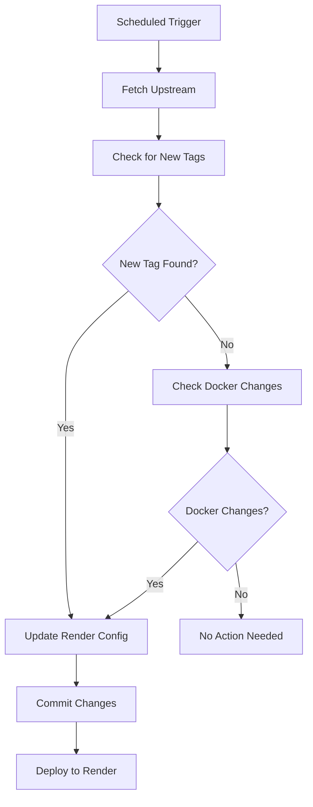

# Automated Sync and Deployment Setup

This guide explains how to set up automated syncing with the upstream RAGFlow repository and automatic deployment to Render.

## Overview

The automation system provides:

1. **Scheduled Sync**: Automatically pulls changes from upstream RAGFlow repository every 6 hours
2. **Tag Detection**: Monitors for new version tags and updates Render configuration accordingly
3. **Docker Change Detection**: Identifies changes in Docker configuration that might affect Render deployment
4. **Automatic Deployment**: Triggers Render deployment when changes are detected
5. **Error Handling**: Creates GitHub issues when automation fails

## Files Created

### GitHub Workflow
- `.github/workflows/sync-and-deploy.yml` - Main automation workflow

### Scripts
- `scripts/update-render-config.py` - Python script to intelligently update Render configuration

### Configuration
- `render.yaml` - Full Render Blueprint configuration
- `render-simple.yaml` - Simplified Render Blueprint
- `RENDER_DEPLOYMENT.md` - Deployment documentation

## Setup Instructions

### 1. Repository Configuration

Make sure your repository is a fork of `infiniflow/ragflow` and has the following branch structure:

```
main - synced with upstream
features/deploy-render - your deployment branch with Render configuration
```

### 2. GitHub Secrets Configuration

You need to set up the following secrets in your GitHub repository:

#### Required Secrets

1. **`RENDER_API_KEY`**
   - Go to [Render Dashboard](https://dashboard.render.com) → Account Settings → API Keys
   - Create a new API key
   - Add it as a repository secret

2. **`RENDER_SERVICE_ID`**
   - Deploy your service to Render first (manually or via Blueprint)
   - Find your service ID in the Render dashboard URL: `https://dashboard.render.com/web/srv-XXXXXXXXXXXXXXXX`
   - The service ID is the part after `srv-`
   - Add it as a repository secret

#### Optional Secrets

3. **`GITHUB_TOKEN`** (usually auto-provided)
   - Used for creating issues on failure
   - GitHub automatically provides this, but you can create a custom one if needed

### 3. Setting Up Secrets

1. Go to your repository on GitHub
2. Navigate to **Settings** → **Secrets and variables** → **Actions**
3. Click **New repository secret**
4. Add each secret:

```
Name: RENDER_API_KEY
Value: rnd_XXXXXXXXXXXXXXXXXXXXXXXXXXXXXXXX

Name: RENDER_SERVICE_ID  
Value: srv-XXXXXXXXXXXXXXXX
```

### 4. Branch Setup

The workflow expects a specific branch structure:

```bash
# Create and push the deployment branch
git checkout -b features/deploy-render
git push origin features/deploy-render
```

### 5. Initial Render Deployment

Before automation can work, you need to deploy to Render at least once:

#### Option A: Deploy via Render Dashboard
1. Go to [Render Dashboard](https://dashboard.render.com)
2. Click "New +" → "Blueprint"
3. Connect your GitHub repository
4. Select the `features/deploy-render` branch
5. Use the `render.yaml` or `render-simple.yaml` file

#### Option B: Deploy via Render CLI
```bash
# Install Render CLI
npm install -g @render/cli

# Login to Render
render login

# Deploy using blueprint
render blueprint deploy --blueprint-path render.yaml
```

### 6. Workflow Triggers

The automation runs:

- **Every 6 hours** (scheduled)
- **On push** to `features/deploy-render` branch
- **Manually** via GitHub Actions UI

## How It Works

### 1. Sync Process



### 2. Version Updates

When a new tag is detected:
- Updates `RAGFLOW_IMAGE` version in Render YAML files
- Updates `RAGFLOW_VERSION` environment variable
- Commits changes to the deployment branch

### 3. Docker Change Detection

The system monitors changes in:
- `docker/` directory
- `Dockerfile*` files
- `requirements.txt`
- `pyproject.toml`

### 4. Render Deployment

Uses Render API to trigger deployment:
```bash
curl -X POST \
  -H "Authorization: Bearer $RENDER_API_KEY" \
  -H "Content-Type: application/json" \
  "https://api.render.com/v1/services/$RENDER_SERVICE_ID/deploys"
```

## Monitoring and Troubleshooting

### Check Workflow Status

1. Go to your repository on GitHub
2. Click **Actions** tab
3. Look for "Sync Upstream and Auto-Deploy to Render" workflows

### View Deployment Logs

1. Check GitHub Actions logs for sync and update process
2. Check Render Dashboard for deployment logs
3. Look for auto-created issues if workflows fail

### Common Issues

#### 1. API Key Issues
```
Error: 401 Unauthorized
```
**Solution**: Check that `RENDER_API_KEY` is correctly set and hasn't expired

#### 2. Service ID Issues
```
Error: Service not found
```
**Solution**: Verify `RENDER_SERVICE_ID` matches your actual Render service

#### 3. Branch Issues
```
Error: Branch 'features/deploy-render' not found
```
**Solution**: Create and push the deployment branch:
```bash
git checkout -b features/deploy-render
git push origin features/deploy-render
```

#### 4. Merge Conflicts
The workflow handles most conflicts automatically, but manual intervention might be needed for:
- Custom modifications to core RAGFlow files
- Complex dependency conflicts

### Manual Intervention

If automation fails, you can:

1. **Manual Sync**:
```bash
git remote add upstream https://github.com/infiniflow/ragflow.git
git fetch upstream
git checkout features/deploy-render
git merge upstream/main
```

2. **Manual Version Update**:
```bash
python scripts/update-render-config.py --version v0.19.2
```

3. **Manual Render Deployment**:
```bash
# Via Render CLI
render deploy --service-id srv-XXXXXXXXXXXXXXXX

# Via Dashboard
# Go to Render Dashboard → Your Service → Deploy Latest Commit
```

## Customization

### Modify Sync Schedule

Edit `.github/workflows/sync-and-deploy.yml`:

```yaml
on:
  schedule:
    # Run every 12 hours instead of 6
    - cron: '0 */12 * * *'
```

### Add Custom Environment Variables

The update script can be extended to handle custom mappings:

```python
# In scripts/update-render-config.py
docker_to_render_mappings = {
    'MYSQL_PASSWORD': 'DATABASE_URL',
    'YOUR_CUSTOM_VAR': 'RENDER_EQUIVALENT',
    # Add more mappings
}
```

### Notification Customization

Modify the notification job to use Slack, Discord, or email instead of GitHub issues.

## Security Considerations

- API keys are stored as GitHub secrets (encrypted)
- Workflow only has access to necessary permissions
- Deployment branch is separate from main development
- All changes are tracked via Git history

## Best Practices

1. **Test Locally**: Always test Render configuration changes locally first
2. **Monitor Deployments**: Check Render dashboard after automated deployments
3. **Keep Secrets Updated**: Rotate API keys periodically
4. **Review Changes**: Check what's being merged from upstream before deployment
5. **Backup Strategy**: Keep manual deployment process documented as backup

## Support

If you encounter issues:

1. Check GitHub Actions logs
2. Review Render deployment logs
3. Check auto-created GitHub issues
4. Manually test the Python update script
5. Verify all secrets are correctly configured

For RAGFlow-specific issues, refer to the [upstream repository](https://github.com/infiniflow/ragflow).
