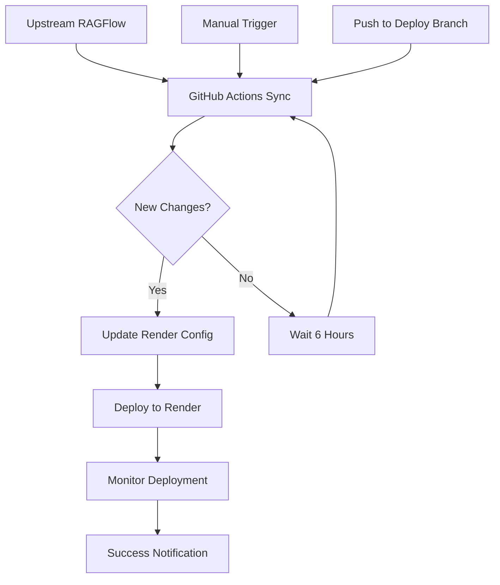

# RAGFlow Render Deployment - Automated Fork

This repository contains an automated deployment system for [RAGFlow](https://github.com/infiniflow/ragflow) on the Render platform. It automatically syncs with the upstream repository, detects new releases, and deploys updates to your Render service.

## 🌟 Features

- **🔄 Automatic Sync**: Pulls changes from upstream RAGFlow repository every 6 hours
- **🏷️ Version Detection**: Automatically detects new version tags and updates deployment
- **🐳 Docker Change Monitoring**: Tracks changes in Docker configuration that affect deployment
- **🚀 Auto-Deployment**: Triggers Render deployment when changes are detected
- **📊 Smart Configuration**: Intelligently updates Render YAML based on upstream changes
- **🔔 Error Notifications**: Creates GitHub issues when automation fails
- **📈 Deployment Tracking**: Provides detailed deployment summaries

## 🚀 Quick Start

### 1. Fork and Clone
```bash
# Fork this repository on GitHub, then clone it
git clone https://github.com/YOUR_USERNAME/ragflow.git
cd ragflow
```

### 2. Run Setup Script
```bash
# Run the automated setup script
./scripts/setup-automation.sh
```

### 3. Configure Secrets
Go to your repository settings and add these secrets:
- `RENDER_API_KEY` - Get from [Render Dashboard](https://dashboard.render.com/account/api-keys)
- `RENDER_SERVICE_ID` - Get from your Render service URL

### 4. Deploy to Render
Use one of the provided blueprints:
- `render.yaml` - Full featured deployment
- `render-simple.yaml` - Minimal deployment

## 📁 Repository Structure

```
├── .github/workflows/
│   └── sync-and-deploy.yml          # Main automation workflow
├── scripts/
│   ├── setup-automation.sh          # Setup script
│   └── update-render-config.py      # Configuration updater
├── render.yaml                      # Full Render Blueprint
├── render-simple.yaml               # Simplified Render Blueprint
├── Dockerfile.render                # Optimized Dockerfile for Render
├── AUTOMATION_SETUP.md              # Detailed setup guide
├── RENDER_DEPLOYMENT.md             # Deployment documentation
└── README-AUTOMATION.md             # This file
```

## 🔧 Configuration Files

### Render Blueprints

#### `render.yaml` - Full Configuration
- Web service with Pro plan
- Background worker service
- PostgreSQL database
- Redis cache
- Comprehensive environment variables
- Health checks and monitoring

#### `render-simple.yaml` - Minimal Configuration
- Basic web service
- PostgreSQL database
- Redis cache
- Essential environment variables only

### Automation Scripts

#### `sync-and-deploy.yml` - GitHub Workflow
- Scheduled execution every 6 hours
- Upstream repository monitoring
- Version detection and updates
- Automatic Render deployment
- Error handling and notifications

#### `update-render-config.py` - Configuration Updater
- Intelligent version updates
- Docker change detection
- Environment variable suggestions
- YAML structure preservation

## 🏗️ Architecture



## 🔄 Automation Workflow

### 1. Scheduled Sync (Every 6 Hours)
- Fetches changes from upstream `infiniflow/ragflow`
- Checks for new version tags
- Monitors Docker configuration changes
- Merges updates into deployment branch

### 2. Configuration Updates
- Updates Docker image versions in Render YAML
- Modifies environment variables
- Suggests new configuration options
- Preserves custom modifications

### 3. Deployment Process
- Validates configuration changes
- Triggers Render deployment via API
- Monitors deployment status
- Creates deployment summaries

### 4. Error Handling
- Detects automation failures
- Creates GitHub issues for investigation
- Provides detailed error logs
- Maintains deployment history

## 🛠️ Manual Operations

### Force Sync with Upstream
```bash
# Manual sync and merge
git remote add upstream https://github.com/infiniflow/ragflow.git
git fetch upstream
git checkout features/deploy-render
git merge upstream/main
```

### Update Configuration Manually
```bash
# Update to specific version
python scripts/update-render-config.py --version v0.19.2

# Check for Docker changes
python scripts/update-render-config.py --check-docker

# Dry run to see changes
python scripts/update-render-config.py --version v0.19.2 --dry-run
```

### Manual Render Deployment
```bash
# Using Render CLI
render deploy --service-id srv-XXXXXXXXXXXXXXXX

# Using curl
curl -X POST \
  -H "Authorization: Bearer $RENDER_API_KEY" \
  -H "Content-Type: application/json" \
  "https://api.render.com/v1/services/$RENDER_SERVICE_ID/deploys"
```

## 🔍 Monitoring

### GitHub Actions
- Check the Actions tab for workflow status
- Review sync and deployment logs
- Monitor for failed runs and issues

### Render Dashboard
- Monitor service health and logs
- Check deployment history
- Review resource usage

### Automated Notifications
- GitHub issues created on failures
- Deployment summaries in workflow runs
- Status updates in pull requests

## 🚨 Troubleshooting

### Common Issues

#### Authentication Errors
```
Error: 401 Unauthorized
```
**Solution**: Check `RENDER_API_KEY` is valid and not expired

#### Service Not Found
```
Error: Service not found
```
**Solution**: Verify `RENDER_SERVICE_ID` matches your Render service

#### Merge Conflicts
```
Error: Merge conflict in...
```
**Solution**: The workflow handles most conflicts automatically, but complex ones may need manual resolution

#### Build Failures
```
Error: Build failed
```
**Solution**: Check Dockerfile and dependency compatibility with Render

### Debug Steps
1. Check GitHub Actions logs
2. Review Render deployment logs  
3. Verify repository secrets
4. Test scripts locally
5. Check branch structure

## 🎛️ Customization

### Modify Sync Schedule
Edit `.github/workflows/sync-and-deploy.yml`:
```yaml
schedule:
  - cron: '0 */12 * * *'  # Every 12 hours instead of 6
```

### Add Custom Environment Variables
Modify `render.yaml` or use the update script to add new variables.

### Change Notification Method
Replace the GitHub issue creation with Slack, Discord, or email notifications.

## 🔐 Security

- All API keys stored as encrypted GitHub secrets
- Limited workflow permissions
- Separate deployment branch for isolation
- All changes tracked in Git history
- No sensitive data in logs

## 📚 Documentation

- **[AUTOMATION_SETUP.md](./AUTOMATION_SETUP.md)** - Detailed setup instructions
- **[RENDER_DEPLOYMENT.md](./RENDER_DEPLOYMENT.md)** - Render deployment guide
- **[Upstream RAGFlow Docs](https://ragflow.io/docs)** - Original RAGFlow documentation

## 🤝 Contributing

1. Fork this repository
2. Create a feature branch
3. Make your changes
4. Test the automation locally
5. Submit a pull request

## 📝 License

This project follows the same license as the upstream RAGFlow project. See the [LICENSE](./LICENSE) file for details.

## 🆘 Support

- Create an issue for automation problems
- Check existing issues for common solutions
- Review the troubleshooting section
- Consult the detailed setup documentation

---

**Note**: This is an automated fork of RAGFlow. For RAGFlow-specific issues, please refer to the [upstream repository](https://github.com/infiniflow/ragflow).
